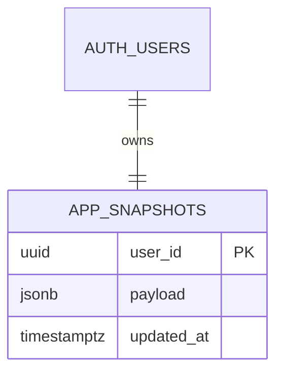

# Cloud Sync

This page describes the current Supabase persistence model.

## Overview

When Supabase is configured:

- the app attempts to load workspace state from Supabase first
- localStorage remains the fallback cache and offline layer
- validated local fallback data can still be pushed back to Supabase manually

If Supabase is not configured or is unreachable, the app continues from the local fallback layer.

## Setup

### 1. Create a Supabase project

1. Go to [supabase.com](https://supabase.com)
2. Create a new project
3. Note the project URL and anon key

### 2. Enable authentication

- Enable Anonymous Sign-Ins if you want browser-scoped anonymous persistence
- Prefer email/password accounts for durable multi-device access

### 3. Run the migrations

Apply:

- `supabase/migrations/202603140001_create_app_snapshots.sql`
- `supabase/migrations/202603140002_auth_games_rbac.sql`

The current bootstrap path uses `public.app_snapshots` as the workspace persistence table.

## Snapshot Table Shape

## How Persistence Works

### App startup

1. Attempt to create or restore a Supabase session
2. Pull the latest `app_snapshots.payload`
3. If a remote snapshot exists, hydrate the workspace from it
4. If no remote snapshot exists, push the current local fallback state to Supabase

### While running

- local edits still save to the fallback layer
- the app replicates changes back to Supabase
- remote failures do not block local editing

### Restore behavior

The settings and archive pages can still:

- push the current fallback cache to Supabase
- restore a Supabase snapshot into the local workspace
- create local backup snapshots before destructive restore operations

## Multi-device Notes

- Anonymous sessions are browser-scoped
- For stable multi-device access, sign in with email/password
- If you sign out of an anonymous session, the associated remote workspace will no longer be attached to that browser session

## Troubleshooting

| Issue                                    | Solution                                                |
| ---------------------------------------- | ------------------------------------------------------- |
| Remote data does not load                | Verify `VITE_SUPABASE_URL` and `VITE_SUPABASE_ANON_KEY` |
| App falls back locally                   | Check network access and Supabase status                |
| New device cannot see the same workspace | Use a named account instead of anonymous auth           |
| Restore overwrote expected local data    | Use the local backup snapshot created before restore    |

_See also: [[Environment Variables]] | [[Architecture Overview]] | [[Troubleshooting]]_
