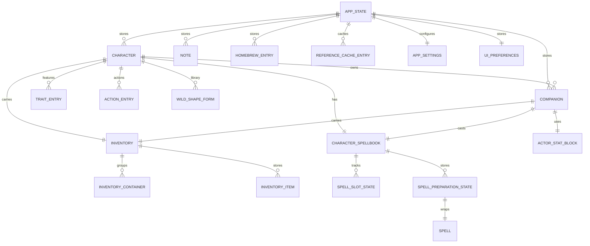
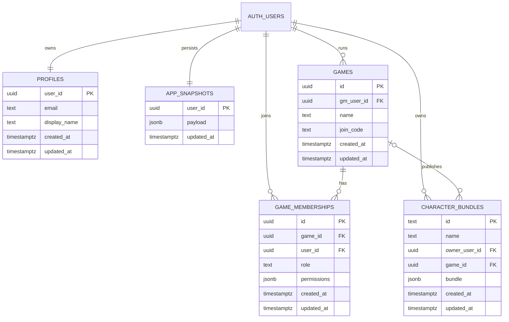

# Data Model ERD

This page shows the current high-level data model for Codex Arcanum.

## Application Model

## Supabase Storage Model

## Notes

- `APP_STATE` is the persisted workspace shape selected by `selectPersistedAppData`.
- `APP_SNAPSHOTS.payload` stores the full workspace snapshot currently used for Supabase bootstrap.
- `CHARACTER_BUNDLES` is the more granular Supabase model already present for game-scoped character distribution.

## Related Pages

- [[Architecture Overview]]
- [[Cloud Sync]]
- [[Roadmap]]
