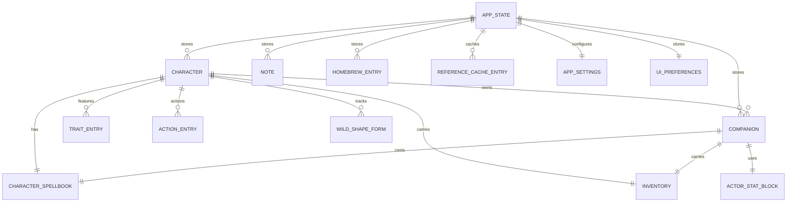
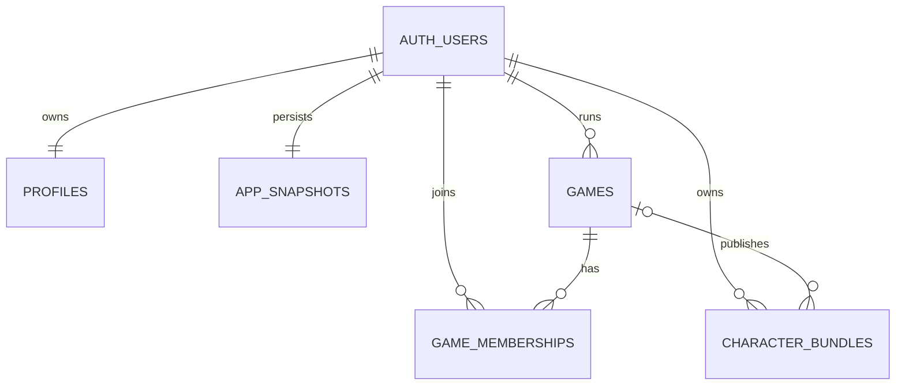

# Codex Arcanum

Codex Arcanum is a D&D 5e character management workspace built with React, TypeScript, Vite, Zustand, Zod, Open5e, and Supabase.

The current app ships as an admin-dashboard style console with a step-based character builder, focused character routes, archive operations, homebrew tooling, and Supabase-backed persistence with localStorage fallback.

## Current Product Surface

- Admin dashboard shell with route-aware workspace navigation
- Multi-step character builder wizard
- Editable character routes for sheet, spells, inventory, companions, forms, and notes
- JSON import, export, backup, and restore tooling
- Open5e-backed reference lookups with local caching
- Supabase-primary persistence when configured, with localStorage as the fallback cache
- Route-level lazy loading for faster initial loads and smaller production bundles

## Stack

- React 19
- TypeScript strict mode
- Vite 8
- React Router 7
- Zustand slice-based store
- Zod runtime validation
- Open5e reference data
- Supabase persistence and auth
- pnpm for package management

## Persistence Model

- If `VITE_SUPABASE_URL` and `VITE_SUPABASE_ANON_KEY` are configured, the app attempts to bootstrap from Supabase first.
- localStorage remains the fallback cache, offline layer, and recovery path.
- If Supabase is unavailable, the app continues running from the local fallback state.

## ERD

### Application Model



### Supabase Storage Model



The wiki contains a more detailed ERD page: [.github/wiki/Data-Model-ERD.md](.github/wiki/Data-Model-ERD.md).

## Requirements

- Node.js 20.19.0 or newer
- pnpm 10.32.1 or newer

## Local Setup

### 1. Install dependencies

```bash
corepack enable
pnpm install
```

### 2. Configure environment variables

```bash
cp .env.example .env.local
```

If Supabase variables are present, the app uses Supabase as the primary persistence layer. If they are left blank, the app runs entirely from the local fallback layer.

### 3. Start the dev server

```bash
pnpm dev
```

### 4. Run checks

```bash
pnpm test
pnpm build
```

`pnpm build` runs the full pipeline: type-check, lint, format check, tests, production build, and size checks.

## Useful Scripts

| Command              | Purpose                                               |
| -------------------- | ----------------------------------------------------- |
| `pnpm dev`           | Start the local dev server                            |
| `pnpm dev:staging`   | Start with `.env.staging`                             |
| `pnpm test`          | Run Vitest once                                       |
| `pnpm test:watch`    | Run Vitest in watch mode                              |
| `pnpm lint`          | Run ESLint                                            |
| `pnpm format`        | Run Prettier                                          |
| `pnpm type-check`    | Run TypeScript without emit                           |
| `pnpm build`         | Run the full validation and production build pipeline |
| `pnpm build:only`    | Build production assets only                          |
| `pnpm build:analyze` | Produce an analyzed production build                  |
| `pnpm size`          | Run size-limit locally                                |

## Project Structure

```text
src/
  app/           Router and top-level app wiring
  components/    Shared UI and layout primitives
  context/       Auth and cross-cutting providers
  domain/        Models, schemas, seeds, and derived rules logic
  features/      Route-focused screens and workflows
  hooks/         Store and service hooks
  services/      Open5e, Supabase, and persistence services
  store/         Zustand store and slices
  styles/        Global and print styles
```

## Supabase Setup

1. Create a Supabase project.
2. Enable Anonymous Sign-Ins in Auth if you want browser-scoped anonymous persistence.
3. Prefer email/password sign-in for durable multi-device access.
4. Apply:
   - `supabase/migrations/202603140001_create_app_snapshots.sql`
   - `supabase/migrations/202603140002_auth_games_rbac.sql`
5. Set `VITE_SUPABASE_URL` and `VITE_SUPABASE_ANON_KEY` in local and deployment environments.

## Deployment

The repository includes GitHub Actions for CI and Vercel deployment.

- `.github/workflows/ci.yml` runs validation on pushes and pull requests.
- `.github/workflows/deploy-vercel.yml` deploys after CI succeeds on `main`.

Recommended branch protection for `main`:

- require CI to pass
- require at least one approving review

## Roadmap

The tracked product direction lives in [docs/CODEX_ARCANUM_ROADMAP.md](docs/CODEX_ARCANUM_ROADMAP.md).

Current implemented focus:

1. Admin-dashboard shell and navigation
2. Supabase-primary persistence with local fallback
3. Step-based builder wizard and modular character routes
4. Progressive execution of the Codex Arcanum roadmap from this baseline
